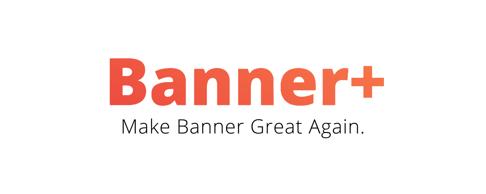

# BannerPlus
BannerPlus (Banner+) is a chrome extension that adds some tweaks to [AUS's Banner page](https://banner.aus.edu). The functionality of these tweaks range from visual effects to improving page load times.

# DISCLAIMER

I am not responsible for you using this tool, and any actions AUS may or may not take against you. You are fully responsible for yourself when you download and install this extension. Consider yourself warned.

# Features (so far)

* Persistent Login (Refreshing does not log you out + faster loading times)
* Prevent Inactive Logout after 15 minutes
* Alert you if you have holds
* Alert you if you have due fees
* Evade AUS' blocking mechanism
* Removing the AUS banner (Easier on the eyes + faster loading times)
* Automatic Login (with built in incorrect credentials detection)
* Automatically highlight closed sections in the registration menu
* Bigger titles (why not?)
* Highlight open and closed courses to make registration easier
* Adding themes to Banner
* Changing of fonts (why not? +1)
* Some fun stuff as well such as emojis for grades, random cat pictures, and MAKING BANNER SCREAM
* Automatic refresh when applying tweaks
* Right clicking on selected CRNs will let you see some info about that CRN
* More coming soon!

# FAQ (Frequently Asked Questions)

#### Can I get in trouble for using this?

I don't know, but you shouldn't since this does not give you any unfair advantage above others, and doesn't directly influence the registration process.

#### Can you add feature X or Y?

Well, probably! See below for more information on how to request a feature.

#### Can you add an auto-registration feature?

Sure, pay me a million AED in cash. (Actually no, because AUS clearly does not allow tools that speed up registration processes.)

# How to Install

1. Go to [BannerPlus' website](https://deadpackets.github.io/BannerPlus)
2. Press Install to Chrome.
3. Done!

# Helping Out

If you wish you support me financially, you can easily do that via:

* My PayPal ([link](https://paypal.me/DeadPackets))
* BTC (Bitcoin) (`1H4Brazgb9LK2RS1xyn1ktiieZhH9mdey`)
* Etherum (`0xa9e344fec0bc76243915Ef099f1cb936798DD3d9`)

# Questions / Bugs / Feature Suggestions

You can ask questions or report bugs or even suggest features either by emailing me at b00073615 [at] aus [dot] edu or by opening an issue on Github.
